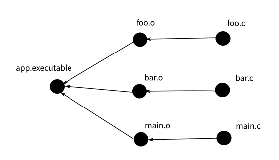

author: Ziming Zhang
comments: true

# 构建工具: Makefile
要想具备完成大型工程的能力，不得不对Makefile有一些了解。

代码变成可执行文件，叫做编译（compile）；先编译这个，还是先编译那个（即编译的安排），叫做构建（build）。

Makefile 是一个项目构建工具，描述了整个项目的编译和链接等规则。其中包含了哪些文件需要编译/不需要编译，哪些文件需要先编译/后编译，哪些文件需要重建等等。

## 1. 为什么需要Makefile？
以 Linux 下的 C 语言开发为例来具体说明一下. 

一个项目需要将`foo.c`, `bar.c`和`main.c`编译生成一个目标程序`app.executable`，使用`gcc`编译的命令如下所示：

```bash
gcc -Wall -c foo.c -o foo.o
gcc -Wall -c bar.c -o bar.o
gcc -Wall -c main.c -o main.o
gcc main.o foo.o bar.o -lpthread -o app.executable
```

如果使用了外部库，还要加上更复杂的参数：

 - `foo.c` 用到了数学计算库 `math` 中的函数，我们得手动添加参数 `-lm`；
 - `bar.c` 用到了小型数据库 `SQLite` 中的函数，我们得手动添加参数 `-lsqlite3`；
 - `main.c` 使用到了线程，我们需要去手动添加参数 `-lpthread`；

在编译的时候命令会很长，并且可能会**涉及到文件链接的顺序问题**，所以手动编译会很麻烦。

按程序员的惯例，凡是要多次重新执行的命令，都应该写成脚本，把一长串编译命令序列写到一个`.sh`文件中。每次编译只要运行脚本就好了。

但这个脚本的问题是如果只修改了`bar.c`，本来只需要重新编译`bar.c`，但是脚本会把所有的文件都重新编译一遍，这样就会浪费很多时间。

如果我们学会使用 Makefile 就不一样了，它会彻底简化编译的操作。把要链接的库文件放在 Makefile 中，制定相应的规则和对应的链接顺序。这样只需要执行 `make` 命令，就可以自动编译所有的文件，并且只编译修改过的文件，大大提高了编译的效率。

???+ tip
	 - Makefile并不是只能用来解决C/C++的编译问题，它可以用来解决任何需要通过一系列命令完成的任务，比如Java项目构建或Latex文档编译等。
	 - 不同的make工具对Makefile本身怎么写的细节是不一样，但从原理上说是非常相似的。本文采用GNU Make的格式作为例子。

## 2. Makefile的概念
Makefile的规则主要是两个部分组成，分别是**依赖关系**和**执行命令**，其结构如下所示：

```makefile
targets : prerequisites
    commands
```

 - `targets`：规则的目标，是必须要有的，可以是 `Object File`（一般称它为中间文件），也可以是可执行文件，还可以是一个标签；
 - `prerequisites`：是我们的依赖文件，要生成 `targets` 需要的文件或者是目标。可以是多个，用空格隔开，也可以是没有；
 - `command`：make 需要执行的命令，可以有多条，每一条命令占一行。如果 command 太长, 可以用 `\` 作为换行符。

按照这个规则，我们构造出上一节中示例项目的 `Makefile` 文件：

<a name="sample1"></a>

```makefile
# Sample1: 
foo.o: foo.c
  gcc -Wall -c foo.c -o foo.o
bar.o: bar.c
  gcc -Wall -c bar.c -o woo.o
main.o: main.c
  gcc -Wall -c main.c -o main.o
app.executable: foo.o bar.o main.o
  gcc main.o foo.o bar.o -lpthread -o app.executable
```

上面的`Makefile`中，`foo.o: foo.c`定义了一个**“依赖关系”**，说明`foo.o`是靠`foo.c`编译成的.

它后面缩进的那些命令，就是简单的shell脚本，称为**“规则(rule)”**。

Makefile的作用就是定义一组依赖关系，当被依赖的文件比依赖的文件新，就执行规则。

这样，前面的问题就解决了。

### 2.1 依赖链
Makefile中的依赖定义构成了一个依赖链（树），比如上面这个`Makefile`中，`app.executable`依赖于`main.o`，`main.o`又依赖于`main.c`，

所以，当需要检查`app.executable`的依赖的时候，它首先去检查`main.o`的依赖，直到找到依赖树的叶子节点(`main.c`)，然后进行时间比较。

这个判断过程由make工具来完成，所以，和一般的脚本不一样。Makefile的执行过程不是基于语句顺序的，而是基于依赖链的顺序的。



### 2.2 宏变量
前面的[Sample1](#sample1)中有很多重复的命令名字，如果要修改这些命令，就需要修改多处，这样很不方便。

所以引入**宏变量**来解决这个问题。

将重复的部分定义为一个宏变量，原来出现的地方用宏变量替换，就成了这样了：

<a name="sample2"></a>

```makefile
# Sample2: 
CC=gcc -Wall -c
LD=gcc

foo.o: foo.c
 $(CC) foo.c -o foo.o
bar.o: bar.c
 $(CC) bar.c -o bar.o
main.o: main.c
 $(CC) main.c -o main.o
app.executable: foo.o woo.o main.o
 $(LD) main.o foo.o bar.o -o app.executable
```

这样需要在命令中增加参数的时候，只需要修改一处就可以了。

#### 2.2.1 自动变量
[Sample2](#sample2)中依赖对象和目标对象的文件名同时出现在依赖关系和执行命令中，可以通过自动变量引用，以对他们进行进一步的简化.

自动变量的值与当前规则有关：

 - `$@`指代目标文件名，就是Make命令当前构建的那个目标。比如，`foo.o: foo.c`的 `$@` 就指代`foo.o`。
 - `$^`指代所有前置条件，之间以空格分隔。比如，规则为 `app.executable: foo.o woo.o main.o`，那么 `$^` 就指代 `foo.o woo.o main.o` 。

可以进一步化简：

<a name="sample3"></a>

```makefile
# Sample3: 
CC=gcc -Wall -c
LD=gcc

foo.o: foo.c
  $(CC) $^ -o $@
bar.o: bar.c
  $(CC) $^ -o $@
main.o: main.c
  $(CC) $^ -o $@
app.executable: foo.o woo.o main.o
  $(LD) $^ -o $@
```

### 2.3 模式匹配
使用匹配符%，可以将大量文件组成列表，然后文件名相同的`.o`文件和`.c`文件组成一条规则。

例如：

```makefile
%.o: %.c
```

等同于

```makefile
foo.o: foo.c
bar.o: bar.c
main.o: main.c
```

因此，[Sample3](#sample3)可以进一步化简为：

<a name="sample4"></a>

```makefile
# Sample4: 
CC=gcc -Wall -c
LD=gcc

%.o: %.c
 $(CC) $^ -o $@
app.executable: foo.o woo.o main.o
 $(LD) $^ -o $@
```

### 2.4 通配符
[sample4](#sample4)中，`app.executable`的依赖文件列表是预先写好的，如果有新的文件加入，就需要手动修改`Makefile`文件，这样也不方便。

**通配符（wildcard）**可以用来指定一组符合条件的文件名。

Makefile 的通配符与 Bash 一样，主要有星号`*`、问号`？`和 `[...]`的组合 。比如， `*.o` 表示所有后缀为`.o`的文件。

简化[sample4](#sample4)中的依赖列表：

<a name="sample5"></a>

```makefile
# Sample5:
CC=gcc -Wall -c
LD=gcc

%.o: %.c
 $(CC) $^ -o $@
app.executable: *.o
 $(LD) $^ -o $@
```

`app.executable: *.o`的意思是：所有的`.o`文件都是`app.executable`的依赖文件。

到这里我们的Makefile已经非常简洁了。

### 2.5 函数
Makefile提供了许多内置函数可供调用，比如`$(wildcard *.c)`可以获取当前目录下所有的`.c`文件。

<a name="sample6"></a>

```makefile
# Sample6:
LD=gcc
LDLIBS=-lpthead
SRC=$(wildcard *.c)
OBJ=$(patsubst %.c, %.o, $(SRC))

app.executable: $(OBJ)
```

 - `$(wildcard *.c)`函数会自动将所有匹配到的`.c`文件展开成一个以空格分隔的列表，然后赋值给`SRC`变量。
 - `$(patsubst %.c, %.o, $(SRC))`表示将`SRC`变量中的所有`.c`文件替换成`.o`后缀。

???+ tip
	这里没有定义`.o`到`.c`的依赖，但GNU make默认如果`.c`存在，`.o`就依赖对应的`.c`，而`.o`到`.c`的rule，是通过宏默认定义的。
	你只要修改`CC`，`LDLIBS`这类内置变量，就能解决大部分问题了。

这样我们又省掉了一组定义，到这里我们的Makefile已经非常简洁了。

### 2.6 伪目标
`make`命令执行的时候，后面跟一个构建目标（不带参数的话默认是第一个依赖的目标），然后以这个目标为根建立整个依赖树。依赖树的每个节点是一个文件，任何时候我们都可以通过比较每个依赖文件和被依赖文件的时间，以决定是否需要执行命令。

但是有些时候，我们需要执行一些不产生文件的操作，比如清理临时文件，这时候就需要用到“伪目标”。

```makefile
.PHONY: clean

clean:
  rm -f *.o
```

上面的`clean`规则中，`.PHONY`声明`clean`是一个伪目标，不是真正的文件名。clean这个文件永远都不会被产生，但是你只要指定这个构建目标，就会执行对应的命令。

???+ info
	到这里Makefile的基本概念和使用方法就介绍得差不多了。想要知道更多关于Makefile的知识，可以参考[更多资料](#3-更多资料)。

## 3. 更多资料
### 3.1 教程

 - [跟我一起写Makefile](https://seisman.github.io/how-to-write-makefile/overview.html)
 - [Makefile Tutorial (英文)](https://makefiletutorial.com/)

### 3.2 快速查阅手册
 - [Make命令教程 - 阮一峰的网络日志](http://www.ruanyifeng.com/blog/2015/02/make.html)

### 3.3 官方文档
 - [GNU make](https://www.gnu.org/software/make/manual/html_node/)

## 参考资料
[^1]: [浅显易懂 Makefile 入门 （01）](https://blog.csdn.net/wohu1104/article/details/110905996)
[^2]: [Makefile概念入门](https://zhuanlan.zhihu.com/p/29910215)
[^3]: [Makefile中文手册](https://www.vimlinux.com/lipeng/2013/08/01/Makefile/)
[^4]: [Makefile中的通配符](https://blog.csdn.net/oqqHuTu12345678/article/details/125647145)