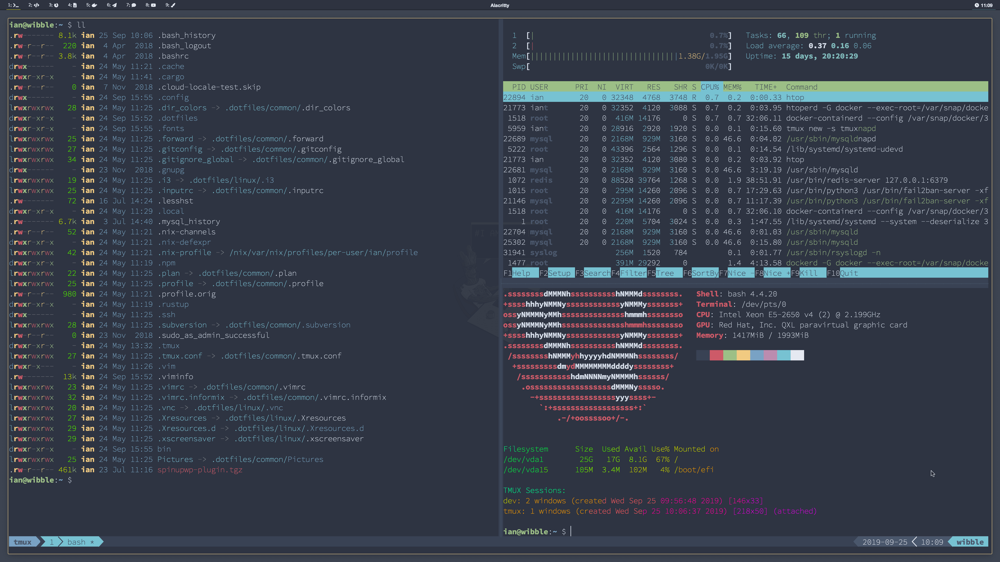

author: 阮一峰, 郭佳明, Ziming Zhang
comments: true

# 终端复用器Tmux
Tmux 是一个终端复用器（terminal multiplexer），非常有用，属于常用的开发工具。

本文介绍如何使用 Tmux。

## 1. Tmux是什么
在终端写命令的时候，经常碰到这几种状况

1. 需要多个终端命令行同时共同工作，但是根本没有自带分屏（比如Ubuntu），只能多开几个terminal
2. 需要ssh远程连接服务器，但是若丢失了与远程系统的连接（比如突然断网或者卡死），那么一切服务都会被关闭

究其原因，在于终端窗口与会话没有完成分离，关闭了窗口，也就关闭了与远程的会话

Tmux的出现改变了这种现状。

为了解决这个问题，会话与窗口可以"解绑"：窗口关闭时，会话并不终止，而是继续运行，等到以后需要的时候，再让会话"绑定"其他窗口。

Tmux 就是会话与窗口的"解绑"工具，将它们彻底分离：

 - 在单个窗口中，同时访问多个会话。这对于同时运行多个命令行程序很有用。
 - 可以让新窗口"接入"之前挂起的会话。
 - 每个会话开启多个连接窗口，多人实时共享会话。
 - 对窗口进行垂直和水平拆分。



### session, window, pane的概念

为了方便后面理解，Tmux 有三个重要的概念需要了解：session, window, pane。

session、window、pane分别对应中文的会话、窗口、面板：

 - session是一个抽象的工作空间，一个session可以有多个Window；
 - windows是一个session中的一个工作窗口，一个window可以有多个pane；
 - pane是一个window中的一个小窗口，用户在一个pane中工作。

## 2. Tmux的安装
=== "Debian或Ubuntu"
	```bash
	sudo apt-get install tmux
	```
=== "CentOS 或 Fedora"
	```bash
	sudo yum install tmux
	```
=== "Mac"
	```bash
	brew install tmux
	```

## 3. Tmux的使用
### 3.1 启动与退出
安装完成后，键入`tmux`命令，就进入了 Tmux 窗口。
```bash
tmux
```

按下`Ctrl+d`或者输入`exit`命令，就可以退出 Tmux 窗口。

### 3.2 Session管理
#### 3.2.1 创建Session
第一个启动的 Tmux 窗口，编号是0，第二个窗口的编号是1，以此类推。这些窗口对应的会话，就是 0 号会话、1 号会话。

使用编号区分会话，不太直观，更好的方法是为会话起名。

```bash
tmux new -s <session-name>
```

#### 3.2.2 列出所有Session
```bash
tmux ls
```

#### 3.2.3 解绑Session与Window
将会话与窗口解绑，窗口关闭时，会话并不终止，而是继续运行，等到以后需要的时候，再让会话"绑定"其他窗口。
```bash
tmux detach
```

#### 3.2.4 进入Session
重新连接到指定会话，可以使用`attach`命令。
```bash
tmux attach -t <session-name>
```


#### 3.2.5 关闭Session
杀死某个会话，可以使用`kill-session`命令。
```bash
tmux kill-session -t <session-name>
```

#### 3.2.6 重命名Session
```bash
tmux rename-session -t <old-name> <new-name>
```

#### 3.2.7 切换Session
```bash
tmux switch -t <session-name>
tmux swithc -t <session-number>
```

### 3.3 Window操作

#### 3.3.1 分割窗口
Tmux 可以将窗口分成多个窗格（pane），每个窗格运行不同的命令。以下命令都是在 Tmux 窗口中执行。
```bash
# 划分上下两个窗格
tmux split-window

# 划分左右两个窗格
tmux split-window -h
```

#### 3.3.2 切换窗格
在窗格间移动光标位置。
```bash
# 光标切换到上方窗格
tmux select-pane -U

# 光标切换到下方窗格
tmux select-pane -D

# 光标切换到左边窗格
tmux select-pane -L

# 光标切换到右边窗格
tmux select-pane -R
```

### 3.4. 其他命令
```bash
# 列出所有快捷键，及其对应的 Tmux 命令
$ tmux list-keys

# 列出所有 Tmux 命令及其参数
$ tmux list-commands

# 列出当前所有 Tmux 会话的信息
$ tmux info

# 重新加载当前的 Tmux 配置
$ tmux source-file ~/.tmux.conf
```

### 4. 快捷键
Tmux 的快捷键非常多，但是只要掌握了最常用的几个，就可以完成大部分工作。

几乎所有Tmux的命令都要配合`ctrl-d`使用。比如显示所有的Tmux session，需要输入指令`ctrl-b + s`，这意味着，你需要先同时按住`ctrl` 和 `b`，然后松开，之后按住`s`。

帮助命令的快捷键是`Ctrl+b ?`，在 Tmux 窗口中，先按下`Ctrl+b`，再按下`?`，就会显示帮助信息。

然后，按下 `ESC` 键或`q`键，就可以退出帮助。

#### 4.1 会话操作快捷键

 - ctrl-b + `s`：显示所有的会话、窗口、面板信息。
 - ctrl-b + `d`：断开当前会话，但不会退出会话，可以用`tmux attach`重新连接。

#### 4.2 窗格操作快捷键

 - Ctrl+b `%`：划分左右两个窗格。
 - Ctrl+b `"`：划分上下两个窗格。
 - Ctrl+b <arrow key>：光标切换到其他窗格。<arrow key>是指向要切换到的窗格的方向键，比如切换到下方窗格，就按方向键`↓`.
 - Ctrl+b `;`;：光标切换到上一个窗格。
 - Ctrl+b `o`：光标切换到下一个窗格。
 - Ctrl+b `{`：当前窗格与上一个窗格交换位置。
 - Ctrl+b `}`：当前窗格与下一个窗格交换位置。
 - Ctrl+b `Ctrl+o`：所有窗格向前移动一个位置，第一个窗格变成最后一个窗格。
 - Ctrl+b `Alt+o`：所有窗格向后移动一个位置，最后一个窗格变成第一个窗格。
 - Ctrl+b `x`：关闭当前窗格。
 - Ctrl+b `!`：将当前窗格拆分为一个独立窗口。
 - Ctrl+b `z`：当前窗格全屏显示，再使用一次会变回原来大小。
 - Ctrl+b `Ctrl+<arrow key>`：按箭头方向调整窗格大小。
 - Ctrl+b `q`：显示窗格编号。


## 参考资料
[^1]: [Tmux使用教程 - 阮一峰的博客](https://www.ruanyifeng.com/blog/2019/10/tmux.html)
[^2]: [Tmux简介 - 郭佳明的博客](https://gls.show/p/34c553/)