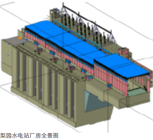

# 使用BIM对建筑全生命周期进行管理

## BIM是什么？
建筑物的设计、工程、施工和运营是一个完整的过程，涉及到多个利益相关者的参与，以实现对人力和自然资源的有效利用。作为一个协作环境，建筑信息模型（BIM）允许对建筑设计和施工进行有效的项目管理。BIM被广泛用于小型和大型项目，特别是在促进项目团队成员之间的沟通和决策。

## BIM标准交换格式: IFC
In general, IFC, or “Industry Foundation Classes”, is a standardized, digital description of the built environment, including buildings and civil infrastructure. It is an open, international standard (ISO 16739-1:2018), meant to be vendor-neutral, or agnostic, and usable across a wide range of hardware devices, software platforms, and interfaces for many different use cases. The IFC schema specification is the primary technical deliverable of buildingSMART International to fulfill its goal to promote openBIM®.

More specifically, the IFC schema is a standardized data model that codifies, in a logical way…

…the identity and semantics (name, machine-readable unique identifier, object type or function)…

…the characteristics or attributes (such as material, color, and thermal properties)…

…and relationships (including locations, connections, and ownership)…

…of objects (like columns or slabs)…

…abstract concepts (performance, costing)…

…processes (installation, operations)…

…and people (owners, designers, contractors, suppliers, etc.).

The schema specification can describe how a facility or installation is used, how it is constructed, and how it is operated. IFC can define physical components of buildings, manufactured products, mechanical/electrical systems, as well as more abstract structural analysis models, energy analysis models, cost breakdowns, work schedules, and much, much more.

## 什么时候用到IFC？
Today, IFC is typically used to exchange information from one party to another for a specific business transaction. For example, an architect may provide an owner with a model of a new facility design, an owner may send that building model to a contractor to request a bid, and a contractor may provide the owner an as-built model with details describing installed equipment and manufacturer information. IFC can also be used as a means of archiving project information, whether incrementally during the design, procurement, and construction phases, or as an “as-built” collection of information for long-term preservation and operations purposes.

The desired IFC data can be encoded in various formats, such as XML, JSON, and STEP (see Standards > Industry Foundation Classes (IFC) > IFC Formats ), and transmitted over web services, imported/exported in files, or managed in centralized or linked databases.

Software vendors of building information modeling tools – including model authoring, design, simulation and analysis, viewing and more – will provide interfaces to end users to export, import, and transmit data in some IFC format. It is up to users to decide what they want to share from their tools via IFC.

Hundreds of software applications for use by many different stakeholders in the process can send and receive IFC data (see Community > Software Implementation ). Since 1997, IFC has been tried and tested through many iterations, gaining worldwide trust as a means to deliver projects from all over the world.

## BIM案例研究
### Avia体育场
Avia体育场建成于2010年，可容纳50000人，由擅长体育建筑设计的Populous（前身HOKSport公司）完成，是第一座完全依靠参数化设计手段完成的体育场馆。整个设计希望成为当地的标志性建筑，同时建筑本身又要与周边环境相融合。

Avia体育场设计采用一个自由的曲线形态，应用Bentley公司的GC软件进行设计，采用多方案比较方法获得对周边环境遮挡最少的形体。整个设计方案建立的过程是：

 - 首先在Rhino建立3D模型，利用3D模型快速建立形体并获得最适合的平面形态。
 - 一旦这个形式得到认可，就会在GC[^1]里建立一个基本模型.
 - 再通过在Rhino中得到的数据导入生成GC脚本，并由此脚本生成新的模型。
 - 而在GC中生成的模型具有很强的可修改性，由结构工程师进行优化，并将结构设计数据导入模型。

在同一个模型中，建筑师负责表皮和建筑形态设计.

结构工程师则在这个模型上面对结构构件尺寸和位置进行调整。这时所有参数的调整、模型的信息都存储在一个Excel表格里。结构工程师只需将调整好的数据输入，建筑师所使用的模型就会及时得到更新。

同时，幕墙顾问公司和建筑师通过统一的建筑模型进行研究，分析实际建造中有关幕墙板材尺寸的问题，并在SolidWork中以原模型的结构中心线作为基础，建立更为细致的幕墙节点模型，并再次对幕墙设计进行优化。正是通过对参数模型的分析，计算出体育场幕墙最小厚度不是设计时选择的8mm厚聚碳酸酯板，而可以采用3mm厚聚碳酸酯板代替，这样整体屋顶材料的质量可以从200t减少到80t，从而使材料的造价成本降低到原来的60%。

通过应用参数化设计及BIM技术，Avia体育场项目最终节约了约350万美金。

### 英杰华体育场

英杰华体育场也被称为“兰斯当路体育馆”，位于爱尔兰的都柏林，于2010年启用，是爱尔兰境内唯一的欧洲足联五星级足球场。英杰华体育场为爱尔兰国家足球队主场球场，于2007年开始建造，2010年完工并启用，全坐席可容50000名观众同时观看比赛。体育场的顶部设计为波浪形。

由于体育场表皮设计的复杂性及在限制条件下需要不断调整的要求，设计师开发出一种以使用Bentley公司软件GC建立的参数化模型为中心的协同工作方式。**参数化的设计方式意味着体育场的几何形态可以通过参数来控制，方案改变时不再需要手动修改和重建模型。**

**1. 参数化方法的技术实现**

由于体育场表皮设计的复杂性及在限制条件下需要不断调整的要求，设计师开发出一种以使用Bentley公司软件GC建立的参数化模型为中心的协同工作方式。参数化的设计方式意味着体育场的几何形态可以通过参数来控制，方案改变时不再需要手动修改和重建模型。

**2.结构分析与反馈**

在设计的发展过程中，体育场外围护的建筑模型要经过多次反复修改，因此有必要建立一个关于设计意图的有效交流机制。项目最具挑战性的方面之一就是将工程分析纳入参数化工作流程中。

为此，采用C#语言通过其应用程序编程接口（API）扩展了GC的内部功能而编写出一个支持参数模型和结构分析软件的集成的自定义应用程序，能将GC参数模型信息直接传输到结构分析软件中。程序自动指定模型中的每个结构元素截面尺寸。完全参数化的系统能够根据建筑师主导的原则和初始概念结构生成整体体育场屋顶结构模型，还能自动生成准备用于分析的数据文件，不需要人工干预。

**3.外壳细部设计**

表层设计由紧随体育场外壳曲率的聚碳酸酯百叶板阵列组成。

表层的初始设计在GC中让面板组建沿着边界层表皮参数化生成。面板宽度不变，长度在面板制造商的限定长度中可变。以这种方式，每块面板的走向和尺寸都由软件自动调整，以适应外壳的曲率变化。

由于覆盖层模型尺寸过大及所需组件数量巨多，试图建立整个体育场外壳的完全参数模型很不现实，因此采用拆分策略解决这一问题。把整个体育场外壳（主模型）拆分成小的子模型，并将附着在第三级桁架上的结构支撑定位四层板宽。以这种方式，超大尺寸参数模型处理困难的问题通过切分成小的可管理部分而得以解决。

**总结**

在结构设计方面，通过自定义集成的参数化模型和结构分析的应用，可以解决复杂模型搭建与修改时用人工处理费时易出错的问题。设计分析反馈周期大幅缩减，体现出开发此自定义应用程序的效果。

在建筑方面，运用参数化模型受益匪浅。通过详细的生成和测试所有候选方案实现了外壳面层的设计目标。通过参数化模型及其支持的建筑师和制造商之间的合作，使得高工程价值的面层系统得以优化生产并以低成本安装。

### 中水顾问集团昆明研究院梨园水电站厂房三维设计
昆明院于2006年开始开展三维可视化设计研究工作，2008年3月，最终选定Autodesk Revit平台， 力求将BIM引入到水电站设计领域中，并先后在糯扎渡，阿海，梨园，那邦，观音岩，黄登、越南开布、老挝北本、大湾、甲岩等10多个国内外大中型水电项目中实践。[^3]

“模型库的建立是一个企业利用Autodesk Revit开展BIM 推广的必由之路”。为将BIM真正引入到水电站设计领域，昆明院做了不少的应用和开发。从2008年起就开始着手建立BIM标准模型库，并在BIM软件上进行二次开发，通过定制和开发来最大化满足设计需求，大到水轮发电机组、桥式起重机、变压器，小到水 泵、阀门、流量开关、压力表等几百个族类型、上万个族实例，所有水电站用到的设备基本上都建立了BIM模型库，完全满足设计需求。

**更符合项目的协同设计模式**

初接触BIM技术的人会被工作集上的协同模式所震撼，并在脑海里深深烙上BIM技术就应该把所有专业都放在一个工作文件内的病根。

在梨园水电站厂房三维设计项目中却没有完全采用这种模式，由于水电站协同专业过多，且不利于管理，所以在该项目中采用了链接和工作集协同相结合的方式：

 - 专业内部采用工作计划协同
 - 专业之间则采用链接协同模式

通过实践证明设计人员对此种协同方式比较赞同。

同时，昆明院利用Autodesk Inventor软件处理复杂造型进行了一些新的尝试：通过最新版的 Autodesk Inventor绘制的复杂设备构件可以通过BIM工作流直接生成Autodesk Revit软件的族文件，通过Autodesk Revit软件直接打开族库文件并可添加、修改相关信息。

**二三维的完美结合**

以三维信息为载体的BIM技术带来了构件本身的 效果，无论多复杂的设备都可真实的展示。在BIM标准模型库制作时，昆明院就已经规划好了模型库与二维出图表示的联动性，并提出“能否指导现场施工是检验标准的唯一真理”。目前昆明院也通过项目的经验积累，完整了适合自身BIM设计的样板文件、可以快速的辅助BIM设计，大大提高设计效率。

对于企业来说BIM设计仅仅只是个开始。在企业实现了提高设计质量之后又将开始更多的重视与施工现场的结合，而完善企业BIM标准模型库将能对相关工程量做出更加精准、快速的统计。经实际施工的效果验证，基于BIM模型的工程量统计精准，有力地保证了现场施工备料工作的顺利进行。

设计的同时，在Autodesk Navisworks中进行可视化的碰撞检查，最大限度地发现模型中存在的各 系统间“错、漏、碰”等问题，为项目的设计质量保驾护航，也为昆明院继续保持领先位置提供保障。通过漫游、动画等BIM软件的小工具也带 来更真实的感受，为项目设计加分。

通过近30个国内外水电站的BIM技术应用，中国水电顾问集团昆明勘测设计研究已经找到了一条属于自己的BIM之路，从模型、图纸的应用阶段，加入的更多信息的探索如工程清单辅助采购、施工等，进一步向BIM应用的深层次发展，即模型与信息紧密结合，赋予模型强大的信息和数据，使之广泛应用于水电工程建设的各个阶段（项目建议书、预可研、可研、招标、施工详图、维护运营），服务于不同的用户人群（业主、设计、监理、施工、运维）。

## 数据集

## 参考资料与标注
[^1]: GC(GenerativeComponents)软件是一款计算设计（Computational Design）软件，它支持几何图形与参数、属性间的依赖，统一了图形编程、脚本和建模
[^2]: BIM案例: BIM技术助力体育馆建设研究
[^3]: 中水顾问昆明院深入应用BIM 助力梨园水电站厂房三维设计
[^4]: [Industry Foundation Classes (IFC) – An Introduction](https://technical.buildingsmart.org/standards/ifc/)